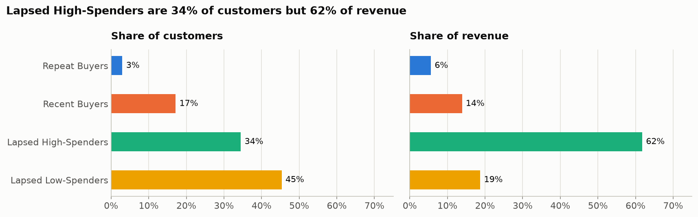
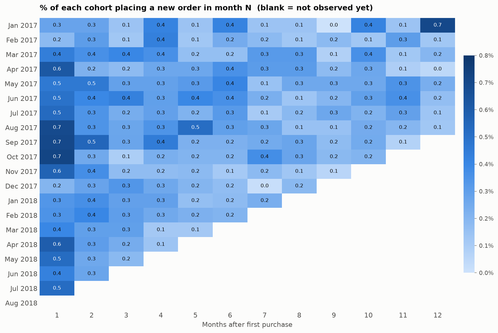
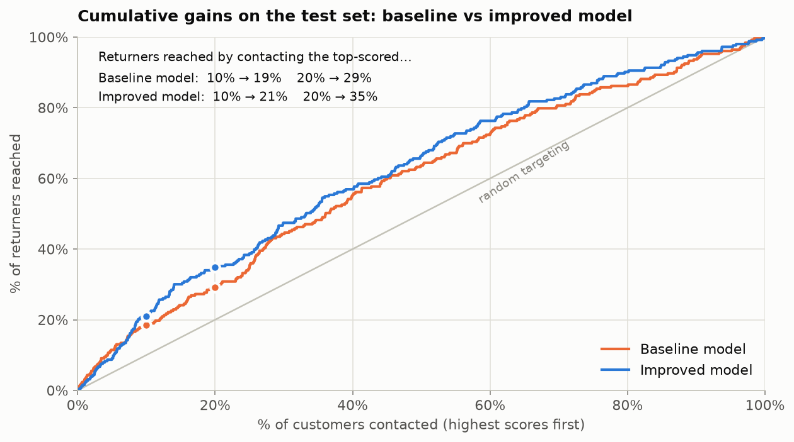

# Olist Customer Analytics: Segmentation, Retention and Repeat-Purchase Prediction

An end-to-end customer analytics project on **Olist**, a Brazilian e-commerce marketplace, using about 100,000 real orders from 2016 to 2018.

1. **Customer segmentation:** RFM features + K-Means split 93,357 customers into four behavioural segments, which are then profiled with review, delivery and payment data.
2. **Cohort retention:** how many customers come back month after month, and whether that improved as Olist grew.
3. **Repeat-purchase prediction:** a classification model that uses only a customer's first purchase to predict whether they'll buy again within 180 days, then scores recent one-time buyers for a retention campaign.

**Tools:** Python · pandas · scikit-learn · matplotlib · Jupyter

---

## Key findings

### 1. Who the customers are



| Segment | Customers | Share of revenue | Median days since last order | Median spend |
|---|---|---|---|---|
| Repeat Buyers | 2,801 (3%) | 6% | 199 | R$226 |
| Recent Buyers | 16,026 (17%) | 14% | 37 | R$104 |
| Lapsed High-Spenders | 32,199 (34%) | 62% | 254 | R$199 |
| Lapsed Low-Spenders | 42,331 (45%) | 19% | 269 | R$66 |

- **97% of customers bought only once.** K-Means isolates the ~3% of repeat buyers as their own segment, then splits one-time buyers by recency and spend.
- **Lapsed High-Spenders are 34% of customers but 62% of revenue.** They made one big-ticket purchase, often paid in many instalments, about 8 months ago.
- **A good experience doesn't bring customers back on its own.** The repeat rate is about 3% whether the first order was rated 1 star or 5 stars.
- **About 30% of "repeat" buyers placed their second order on the same day as their first,** which is usually a split checkout rather than a real return.

### 2. Retention



- Month-by-month retention is **below 1% for every cohort**, and only 3.3% of customers come back within a full year.
- Monthly new-customer volume grew about **ninefold** during 2017, but the 90-day return rate stayed between **0.8% and 1.8%**. Growth came from acquisition, not retention.

### 3. Predicting who comes back



| Model | CV ROC-AUC | Test ROC-AUC | Top 10% return rate vs. average |
|---|---|---|---|
| Baseline (logistic regression) | 0.559 | 0.597 | 1.9× |
| Improved (new features + LR/GB blend) | 0.579 | 0.624 | 2.1× |

- **Setup:** the target is a genuine return within 180 days, features come from the first purchase day only, and the train/test split is by time.
- **Better features beat a better algorithm.** Gradient boosting alone didn't beat logistic regression. Adding seller/product history (leakage-safe target encoding), finer location and review-survey engagement improved the model in **all 5 CV folds**, with a test gain of +0.027 ROC-AUC (95% CI +0.003 to +0.052).
- **Strongest signals:** first-purchase category, state, delivery experience, seller quality, and how quickly the customer answers the review survey.
- **Honest ceiling:** most returners look like everyone else at their first purchase. A big jump would need behavioural data such as browsing history or email opens.

---

## Project structure

```
olist-customer-analytics/
├── data/
│   └── raw/                  # Olist CSVs go here (not committed, see data/raw/README.md)
├── notebooks/
│   ├── 01_customer_segmentation.ipynb
│   └── 02_retention_and_repeat_prediction.ipynb
├── src/
│   ├── config.py             # project paths and random seed
│   ├── data.py               # loads the raw tables with consistent types
│   └── style.py              # shared chart style
├── outputs/                  # CSVs created by the notebooks (not committed)
├── reports/
│   └── figures/              # charts used in this README
├── requirements.txt
└── README.md
```

## How to run it

### 1. Get the data
Download the [Brazilian E-Commerce Public Dataset by Olist](https://www.kaggle.com/datasets/olistbr/brazilian-ecommerce) from Kaggle and unzip the CSVs into `data/raw/`.

### 2. Set up the environment (Python 3.10+)

Open the project folder in VS Code, then open a terminal (**Terminal → New Terminal**):

**Windows**
```
python -m venv .venv
.venv\Scripts\activate
pip install -r requirements.txt
```

**macOS / Linux**
```
python3 -m venv .venv
source .venv/bin/activate
pip install -r requirements.txt
```

### 3. Run the notebooks
1. Install the **Python** and **Jupyter** extensions in VS Code if you don't have them.
2. Open `notebooks/01_customer_segmentation.ipynb`.
3. Click **Select Kernel** (top right), choose **Python Environments**, then pick `.venv`.
4. Click **Run All**. Then do the same for notebook 02.

Notebook 01 takes about 1.5 minutes and notebook 02 about 2 minutes. Results are written to `outputs/`, and charts to `reports/figures/`.

Tested with Python 3.11, pandas 3.0, scikit-learn 1.8 and matplotlib 3.10.

## Method in brief

**Notebook 01: segmentation**
1. Keep delivered orders only, and identify people by `customer_unique_id` (`customer_id` changes with every order).
2. Compute Recency, Frequency and Monetary per customer, then apply `log1p` and `StandardScaler`.
3. Choose k with the elbow, silhouette and Davies–Bouldin scores (k = 4). Check stability across random seeds (ARI ≥ 0.99).
4. Name segments by rules on cluster statistics, then profile them by reviews, delivery, instalments and categories.

**Notebook 02: retention and prediction**
1. Build monthly cohorts and a retention heatmap, leaving unobserved months blank rather than zero.
2. Set up the prediction: a 180-day label window, only customers with a complete window, first-day features only, and a time-based split (train on 2016–2017, test on Jan–Feb 2018).
3. Build a baseline logistic regression and gradient boosting model, evaluated with ROC-AUC, PR-AUC, lift and cumulative gains, plus bootstrap confidence intervals.
4. Improve the model with 13 new features. Seller, product and location IDs use scikit-learn's cross-fitted `TargetEncoder`, and seller/product history counts only earlier orders. Choose the model by CV only, then confirm on the test set with a paired bootstrap.
5. Score 36,901 recent one-time buyers into deciles for a retention campaign.

## Limitations

- Frequency barely varies (97% one-time buyers), so the segmentation is effectively "recency and spend plus a repeat flag".
- Model coefficients show association, not causation. Test any campaign against a randomised holdout group.
- There is one test period with about 250 returners. Rolling time-based validation would be more robust with more data.

## Data source and licence

Data: [Brazilian E-Commerce Public Dataset by Olist](https://www.kaggle.com/datasets/olistbr/brazilian-ecommerce), released by Olist on Kaggle for non-commercial use. See the Kaggle page for the licence terms. The data is not redistributed in this repository.
